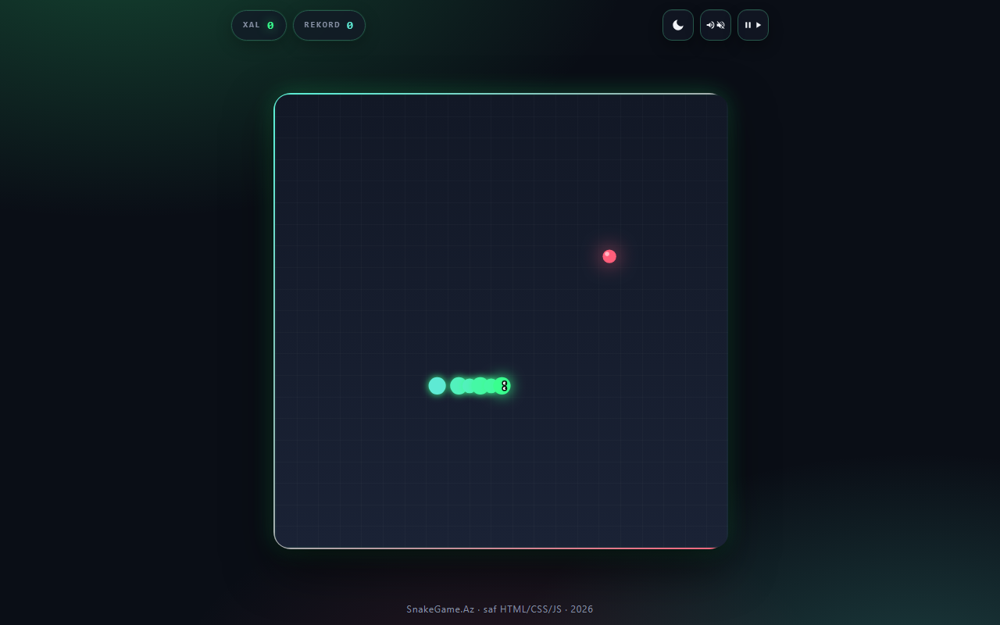
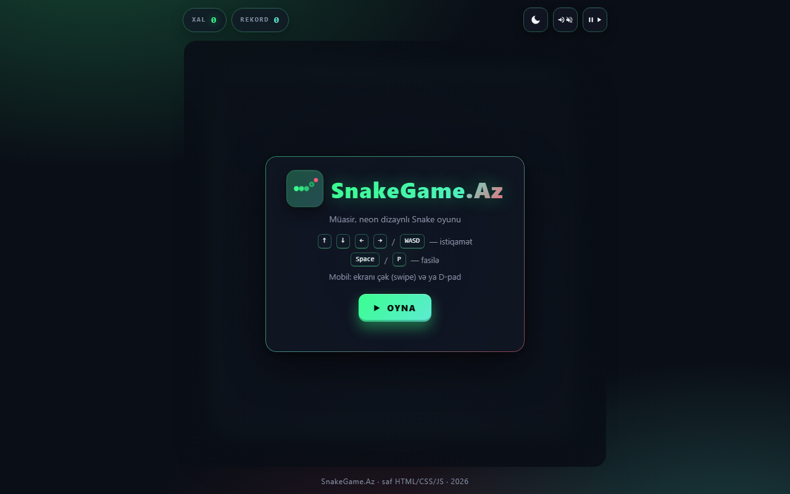
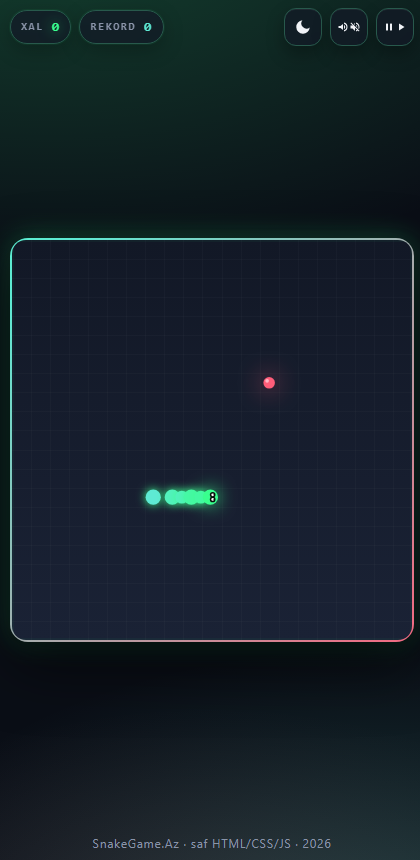

<div align="center">

# SnakeGame.Az

**Müasir, neon-üslublu Snake oyunu — saf HTML, CSS və JavaScript ilə hazırlanmış, mobil və masaüstü üçün tam uyğunlaşdırılmış canvas oyunu.**

*A modern, neon-styled Snake game built with pure HTML, CSS and vanilla JavaScript — fully responsive on mobile and desktop.*

[](https://goshgarhasanov.github.io/snake-az/)
[](#lisenziya)
[](#)
[](#)
[](https://goshgarhasanov.github.io/snake-az/)

</div>

---

## Canlı Demo

> **→ [https://goshgarhasanov.github.io/snake-az/](https://goshgarhasanov.github.io/snake-az/)**

Heç bir quraşdırmaya, qeydiyyata və ya kukiyə ehtiyac yoxdur. Səhifəni açın və oynamağa başlayın.

---

## Ekran görüntüləri / Screenshots

<div align="center">

### Oyun anı / In-game



### Başlıq və mobil görünüş / Hero & Mobile

<table>
  <tr>
    <td align="center" width="55%">
      <strong>Başlıq ekranı (masaüstü)</strong><br/>
      
    </td>
    <td align="center" width="45%">
      <strong>Mobil — oyun anı</strong><br/>
      
    </td>
  </tr>
</table>

</div>

---

## Description

**Azərbaycan dilində:** Bu, Google Chrome-un ilkin oyunlarından ilham alaraq sıfırdan yenidən yazılmış, vizual olaraq cilalanmış müasir bir Snake (ilan) oyunudur. Kod tamamilə vanilla JavaScript ilə yazılıb, modullara bölünüb (oyun, render, input, audio, UI) və heç bir xarici framework istifadə edilməyib. Mobil cihazlarda swipe (sürüşdürmə) və ekran üzərindəki D-pad ilə, masaüstündə isə klaviatura ilə rahat oynanır. GitHub Pages-də heç bir build addımı olmadan dəstəklənir.

**In English:** A polished, modern reimagining of the classic Snake game written from scratch as a portfolio-grade browser project. Vanilla ES6 JavaScript with clean module separation (game, render, input, audio, UI) — no frameworks, no build step. Mobile users can play with swipe gestures or an on-screen D-pad; desktop users use the keyboard. Hostable on any static server, including GitHub Pages.

---

## Xüsusiyyətlər / Features

| | |
|---|---|
| **Klassik şəbəkə üzərində hərəkət** | 21 × 21 ölçülü oyun sahəsi, hüceyrələr arasında yumşaq interpolyasiya |
| **Smooth movement** | Cell-to-cell linear interpolation (no jittery steps) |
| **Tədrici çətinlik** | Hər yeyilmiş yeməkdən sonra sürət artır (7.5 → 16 addım/saniyə) |
| **Bonus yemək** | Hər 7 yeməkdən bir qızılı bonus ortaya çıxır (+50 xal, məhdud vaxt) |
| **Çarpışma sistemi** | Divara və özünə çırpılma ayrı-ayrı tanınır, ölüm səbəbi göstərilir |
| **Particle effektləri** | Yemək yedikdə qığılcımlar, ölümdə partlama efekti |
| **Neon vizual üslub** | Yaşıl ilan, çəhrayı yemək, yumuşaq glow effektləri, gradient çərçivə |
| **Tünd və açıq tema** | Düymə ilə real vaxtda dəyişir, seçim `localStorage`-də saxlanılır |
| **Glassmorphism panellər** | Şəffaf, blur effekti olan overlay-lar |
| **Web Audio səslər** | Ye / bonus / ölüm / fasilə üçün sintez səslər (audio fayl yoxdur) |
| **Səs aç/bağla** | Düymə ilə anlıq dəyişir, parametr `localStorage`-də qalır |
| **Vibrasiya** | Mobil cihazlarda yemək yeyəndə və ölümdə vibrasiya |
| **Avtomatik fasilə** | Səhifə fonda olduqda oyun özbaşına dayanır |
| **Rekord** | `localStorage`-də saxlanılır, oyun sonu ekranında yeni rekord göstərilir |
| **Safe-area dəstəyi** | iPhone notch və yumru ekran kənarlarına hörmət edir |
| **Reduced motion** | `prefers-reduced-motion` parametrinə uyğun olaraq animasiyalar dayandırılır |
| **Tam responsiv** | 320 piksellik telefondan tutmuş geniş masaüstünə qədər |

---

## İdarəetmə / Controls

### Masaüstü / Desktop

| Hərəkət / Action | Düymələr / Keys |
|---|---|
| İstiqamət / Direction | `↑` `↓` `←` `→` · `W` `A` `S` `D` |
| Fasilə / Pause | `Space` · `P` |
| Yenidən başlamaq / Restart | `Enter` · `R` |

### Mobil / Mobile

| Hərəkət | Toxunma / Gesture |
|---|---|
| İstiqamət | Ekrana sürüşdürmə (swipe) və ya **D-pad** düymələri |
| Fasilə | HUD-dakı **⏸** düyməsi |
| Səs | HUD-dakı **🔊** düyməsi |
| Tema | HUD-dakı **🌙** düyməsi |
| Yenidən başlamaq | Ekrana qısa toxunma və ya **Yenidən başla** düyməsi |

---

## Lokal işə salmaq / Run locally

Bu, build addımı olmayan tam statik bir saytdır. Lakin ES modulları `file://` protokolu ilə yüklənmədiyindən lokal server tələb olunur:

```bash
# 1) Node ilə
npx serve .

# 2) Python ilə
python -m http.server 8000

# 3) VS Code üçün — "Live Server" genişlənməsi
```

Sonra brauzerdə `http://localhost:8000` ünvanını açın.

> **Qeyd:** Səs effektləri ilk istifadəçi hərəkətindən sonra aktivləşir (brauzer autoplay siyasəti). Hər hansı düyməyə basmaq və ya ekrana toxunmaq kifayətdir.

---

## GitHub Pages-də deploy etmək

Layihəni öz hesabınızda yerləşdirmək çox sadədir:

```bash
# 1) Klonlayın və yenidən başlayın
git clone https://github.com/goshgarhasanov/snake-az.git
cd snake-az

# 2) Öz repozitorinizə bağlayın
git remote set-url origin https://github.com/<istifadəçi>/<repo>.git
git push -u origin main

# 3) Pages-i aktivləşdirin (gh CLI ilə)
gh api -X POST repos/<istifadəçi>/<repo>/pages \
  -f "source[branch]=main" -f "source[path]=/"
```

Yaxud GitHub veb-interfeysindən: **Settings → Pages → Source: main / (root)**.

Build addımı yoxdur — repodakı fayllar olduğu kimi xidmət olunur.

---

## Layihənin strukturu / Project structure

```
snake-az/
├─ index.html          # HTML markup, HUD, overlay, D-pad
├─ styles.css          # responsiv layout, tünd və açıq tema, animasiyalar
├─ src/
│  ├─ main.js          # bootstrap, oyun döngüsü, event-lər
│  ├─ game.js          # state, snake, food, collision, speed ramp
│  ├─ render.js        # canvas rəsmi, snake/food/particle çəkiliş
│  ├─ input.js         # klaviatura, swipe, D-pad
│  ├─ audio.js         # Web Audio sintezi
│  └─ ui.js            # overlay state, HUD update, theme, localStorage
├─ README.md
└─ .gitignore
```

### Modul ayrılığı

- **`game.js`** — saf oyun məntiqi. DOM-a toxunmur, render və ya input bilmir. Test edilməsi rahatdır.
- **`render.js`** — yalnız canvas rəsmi. Oyun state-ini oxuyur, mutasiya etmir.
- **`input.js`** — klaviatura və toxunma hadisələri tutub callback-lərə ötürür.
- **`audio.js`** — `Web Audio API` ilə anlıq səs sintezi. localStorage-də mute durumunu saxlayır.
- **`ui.js`** — DOM elementləri, ekran keçidləri, theme və best-score saxlanması.
- **`main.js`** — yuxarıdakı modulları birləşdirir, oyun döngüsünü idarə edir, particle sistemini saxlayır.

---

## Performans / Performance

- `requestAnimationFrame` ilə render döngüsü
- Sabit zaman addımlı (fixed-timestep) məntiq, FPS dəyişikliyindən asılı deyil
- DPR (Device Pixel Ratio) məhdudiyyəti — yüksək dəqiqlikli ekranlarda da hamar
- `O(N)` çarpışma yoxlaması (Set ilə optimallaşdırılmış yemək yerləşdirilməsi)
- DOM mutasiyası yalnız HUD/overlay-da, oyun sahəsi tamamilə canvas-dadır
- Particle massivi avtomatik təmizlənir (lifetime-əsaslı)

---

## Çətinlik dinamikası / Difficulty curve

```
Başlanğıc sürət : 7.5 addım / saniyə
Maksimum sürət  : 16 addım / saniyə
Sürət artımı    : hər yeyilmiş yeməkdən sonra +0.18 addım/saniyə
Bonus tezliyi   : hər 7 yeməkdən bir
Bonus dəyəri    : 50 xal (adi yemək: 10 xal)
Bonus ömrü      : 5.5 saniyə
İlanın uzunluğu : başlanğıcda 4 hüceyrə, hər yeməklə +1
```

---

## Rəng paleti / Color palette

| Element | Tünd / Dark | Açıq / Light |
|---|---|---|
| İlanın başı / Snake head | `#39ff8e` | `#0fb96b` |
| İlanın gövdəsi (gradient) | `#39ff8e` → `#5eead4` | `#0fb96b` → `#0f9d8b` |
| Adi yemək / Food | `#ff5e7a` | `#d63d6e` |
| Bonus yemək | `#ffb84d` | `#d97706` |
| Fon / Background | `#0a0e16` | `#f4f6fb` |

---

## Brauzer dəstəyi / Browser support

Müasir brauzerlərin hamısı dəstəklənir:

| Brauzer | Vəziyyət |
|---|---|
| Chrome və Edge ≥ 100 | tam dəstək |
| Firefox ≥ 100 | tam dəstək |
| Safari ≥ 15 (iOS daxil) | tam dəstək |
| Samsung Internet | tam dəstək |

CSS `color-mix()`, `dvh`, `aspect-ratio` və müasir Pointer Events istifadə olunur.

---

## Yol xəritəsi / Roadmap

- [ ] Onlayn rekord siyahısı (leaderboard)
- [ ] Müxtəlif rejimlər (divarsız wrap-around, sürətli arcade, klassik)
- [ ] Müxtəlif ilan görünüşləri (skinlər)
- [ ] PWA dəstəyi — internetsiz oynamaq üçün
- [ ] Çoxlu oyunçu rejimi (lokal split-screen)

---

## Lisenziya / License

Bu layihə **[MIT](LICENSE)** lisenziyası altında paylaşılır. Hətta kommersiya məqsədli layihələrdə belə sərbəst istifadə edə, dəyişdirə və yenidən paylaşa bilərsiniz. Yeganə şərt orijinal lisenziya bildirişinin saxlanılmasıdır.

---

<div align="center">

**Bakıda hazırlandı · Made in Baku · 2026**

[Demo](https://goshgarhasanov.github.io/snake-az/) · [Issues](https://github.com/goshgarhasanov/snake-az/issues) · [GitHub](https://github.com/goshgarhasanov/snake-az)

</div>
